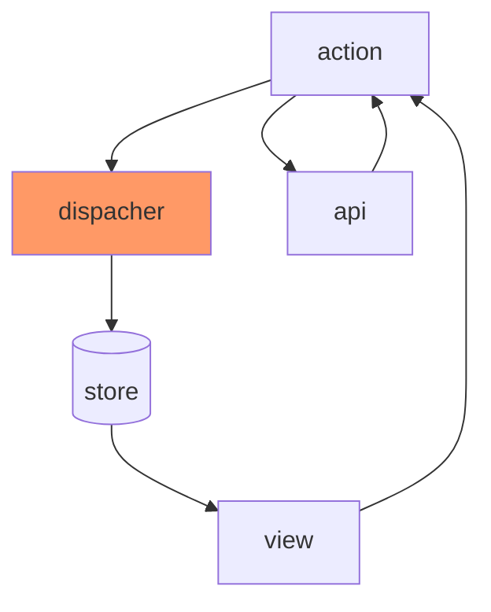

## Mô hình flux:

```mermaid
flowchart TB
    action --> dispacher
    dispacher:::someclass --> id2
    id2[(store)] --> view
    view --> action
    api --> action
    action --> api

    classDef someclass fill:#f96
```

### Hiểu chưa

- [ ] hiểu
- [x] chưa
